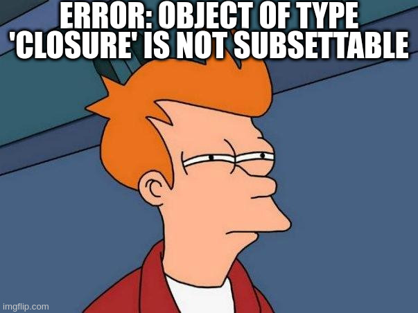
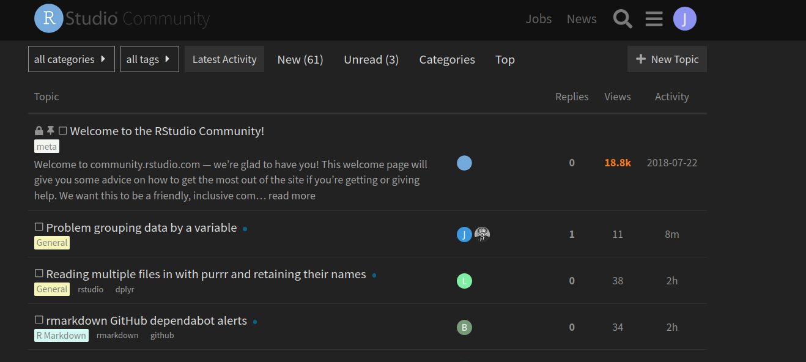

## What do you do when you need to solve a problem in R? 

If you have been programming for any amount of time, you have learned that you are likely to encounter errors programming in R and resolving those coding errors can be challenging. 

For most everyone, goggling an error message is the first step. This is not a bad choice as it often leads you to people who have already encountered the error and solved it. But, it can also lead you to a labyrinth of different, possible conflicting, possibly incomprehensible solutions. Additionally, it is not always the most time efficient method to solve a coding problem. 

## Some Alternatives

### Check the documentation!

There's an ancient proverb about the importance of reading documentation: "you can spend 2 hours searching the web in order to save 15 minutes of reading the documentation." 

Package and function documentation can be very helpful. There are two main aspects of documentation:   

1. Function reference: this describes the arguments a function can take, the expected format for those arguments and information about the function object. It may also contain theoretical details that are needed to understand the argument options and examples. Documentation varies in quality greatly across R packages. It can occasionally be too bare bones to be useful, but often (especially in base R commands and tidyverse packages) the documentation is very detailed and helpful. Submission to CRAN requires that packages have a documentation file that lists all package function documentation in alphabetical order. 
1. Vignettes: these are tutorials accompanying how to use a package functions. These usually cover a subset of functions and include text explanations. They are basically long examples. Vignettes can be enormously helpful. They are not required for submission to CRAN, so they are not always available, especially for older legacy packages. You can find these on the package website (if it exists) or its CRAN link. Here are some vignettes from the package [{tidyr}](https://CRAN.R-project.org/package=tidyr). 

#### How do we find documentation?

You find function documentation via the R console: 


```r
?par  # does an exact search on "par"
??plot  # does a fuzzy match on "plot"
```

This will open help files for those items. 

Sometimes, you will discover there are multiple options and possibly different help files associated with a function name (just run `methods('mean')` or `methods('anova')` to see what I mean). 

These are functions that act differently depending on the R object type they are called to interact with (e.g. `mean(some_dates)` will behave differently than `mean(some_numbers)`). Which leads to the next point: all R objects have a class assigned to them. You can check this with `class()`. 


```r
y <- rnorm(20); x <- y + rnorm(20) 
m <- lm(y ~ x)
class(y)
```

```
## [1] "numeric"
```

```r
class(m)
```

```
## [1] "lm"
```

Understanding this difference between functions will help you understand which documentation files will help you solve your problem.  

More importantly, once you know the object class, you can search for methods that exist for that class. 


```r
methods(class = "lm")
```

```
##  [1] add1           alias          anova          case.names     coerce        
##  [6] confint        cooks.distance deviance       dfbeta         dfbetas       
## [11] drop1          dummy.coef     effects        extractAIC     family        
## [16] formula        hatvalues      influence      initialize     kappa         
## [21] labels         logLik         model.frame    model.matrix   nobs          
## [26] plot           predict        print          proj           qr            
## [31] residuals      rstandard      rstudent       show           simulate      
## [36] slotsFromS3    summary        variable.names vcov          
## see '?methods' for accessing help and source code
```

From this, we can see a special `plot()` option exists (that provides several diagnostic plots), functions for extracting residuals (`rstudent()`, `residuals()`), a version of `anova()` written for object type "lm", and much much more. 

### Read your error messages

Error messages can be obtuse and confusing (especially if you are new to programming). We have all have experienced (and will experience again) this error message: 



It is telling us we are trying to subset (extract) information from a 'closure' (which is a function). In essence, there was an attempt to do something like `mean$myvar` when `mean()` is a function, not a data.frame. 

However, error messages can also be trying to tell you something important. Here's a recent experience of mine: 


Over time, these messages will become comprehensible. It's still the same messages, but your R knowledge will help you understand them. But, becoming fluent in R error messages implies *reading them and trying to understand them*. 

### Specific places to ask for help

Eventually, you may need to search forums or ask for help from kind strangers. If Google fails you, here are some other useful resources: 

* [RStudio Community](https://community.rstudio.com/), a helpful forum that is only for R questions. It is run by RStudio and moderated (to an extent). This is one of the more useful sites to search or post on. 
<br>  



* [R4DS community](https://www.rfordatasci.com/), a friendly, welcoming community. Join their slack channel and ask a question.   
<br>   
  


* [Stack overflow](https://stackoverflow.com/), the long-established site of all questions programming. Can often be helpful. 
<br>  


### Consider reading the source code

This is best for advanced users, but it can hep you resolve very specific questions about a function. Reading source code will also help improve your own coding. 

** How to find source code: **

* Type the function name in the console without parentheses: 

```r
mean.default
```

```
## function (x, trim = 0, na.rm = FALSE, ...) 
## {
##     if (!is.numeric(x) && !is.complex(x) && !is.logical(x)) {
##         warning("argument is not numeric or logical: returning NA")
##         return(NA_real_)
##     }
##     if (isTRUE(na.rm)) 
##         x <- x[!is.na(x)]
##     if (!is.numeric(trim) || length(trim) != 1L) 
##         stop("'trim' must be numeric of length one")
##     n <- length(x)
##     if (trim > 0 && n) {
##         if (is.complex(x)) 
##             stop("trimmed means are not defined for complex data")
##         if (anyNA(x)) 
##             return(NA_real_)
##         if (trim >= 0.5) 
##             return(stats::median(x, na.rm = FALSE))
##         lo <- floor(n * trim) + 1
##         hi <- n + 1 - lo
##         x <- sort.int(x, partial = unique(c(lo, hi)))[lo:hi]
##     }
##     .Internal(mean(x))
## }
## <bytecode: 0x00000236dcfa19e8>
## <environment: namespace:base>
```

* Sometimes this is not informative   

```r
c
```

```
## function (...)  .Primitive("c")
```

```r
subset
```

```
## function (x, ...) 
## UseMethod("subset")
## <bytecode: 0x00000236daf25fb8>
## <environment: namespace:base>
```

```r
`[`
```

```
## .Primitive("[")
```

* Use {the package {lookup} to find what you need


```r
remotes::install_github("jimhester/lookup")
lookup::lookup(`[`)
```

{lookup} checks CRAN, Bioconductor and GitHub for source code! Prior to {lookup}, finding source code for R functions was [challenging](https://github.com/jennybc/access-r-source#readme). Please note that this "lookup" is NOT the same same package called "lookup" found on CRAN. They have zero overlapping functionality. 
