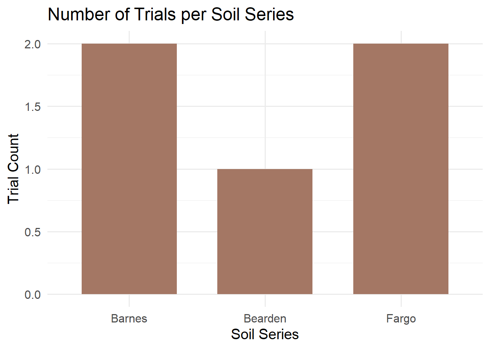
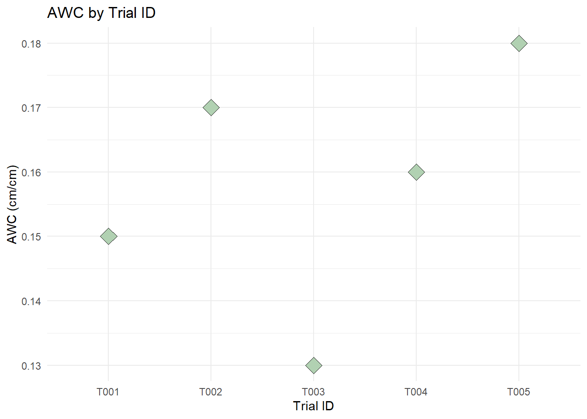
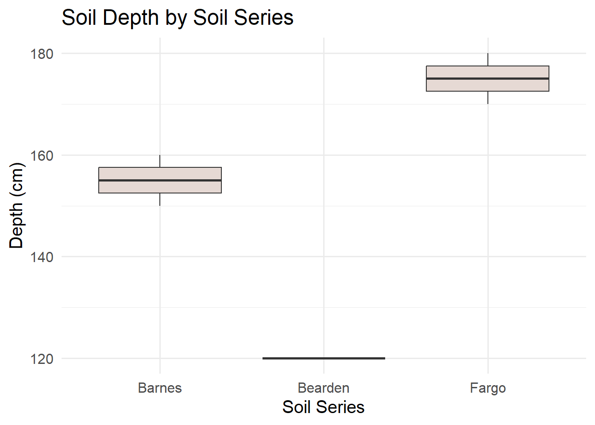
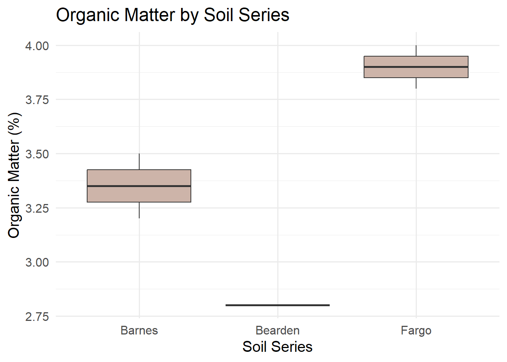
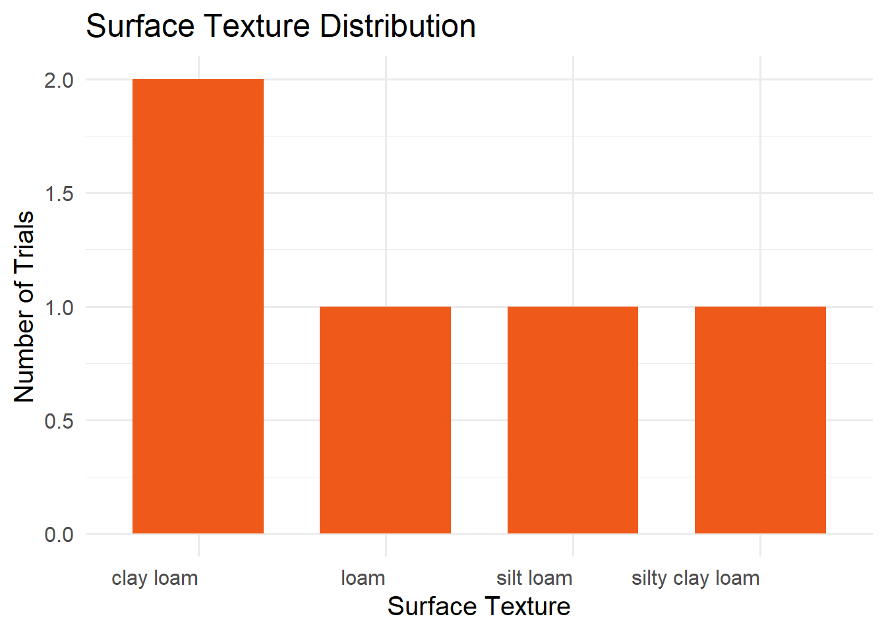
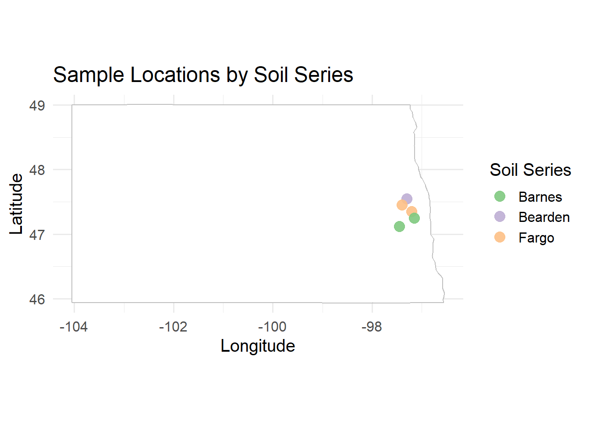
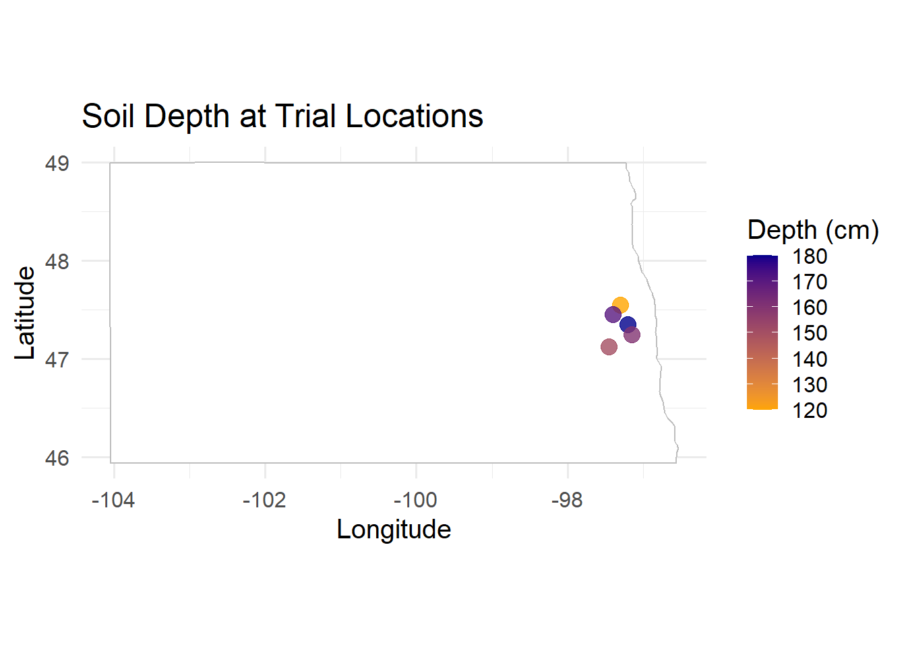

Working with agricultural data often requires accurate soil information. Instead of manually searching soil survey data from [**Web Soil Survey**](https://websoilsurvey.nrcs.usda.gov/app/WebSoilSurvey.aspx), we can access the [**SSURGO**](https://websoilsurvey.nrcs.usda.gov/app/)** (Soil Survey Geographic Database) through the [**soilDB**](https://CRAN.R-project.org/package=soilDB) package in R using spatial queries.

This guide shows how to:

- Query the SSURGO database for a specific point  
- Retrieve soil attributes like texture, bulk density, soil series classification, soil depth, soil organic matter and water holding capacity   
- Write a reusable function 
- Apply it to a whole data set 
- Visualize results spatially


### Required Packages

We’ll need the following R packages installed and loaded:

These libraries enable querying soil databases (soilDB), manipulating data (dplyr), and handling spatial formats (sf).


## Step 1: Retrieve Soil Data for a Single Point

Start with a test location. We will use latitude and longitude to generate a spatial point in Well-Known Text (WKT) format and query the SDA (Soil Data Access) API for its MUKEY, a key that uniquely identifies a soil map unit.


``` r
# Coordinates for the example point (a point roughly 19 miles northwest of Fargo, ND)
lon <- -97.0
lat <- 47.0
my_point <- sprintf("POINT(%f %f)", lon, lat)

# Get MUKEY (Map Unit Key)
sql <- sprintf("SELECT mukey FROM SDA_Get_Mukey_from_intersection_with_WktWgs84('%s')", my_point)
mukey_result <- SDA_query(sql)
```

```
## single result set, returning a data.frame
```

``` r
mukey <- mukey_result$mukey[1]
print(mukey)
```

```
## [1] 2521602
```

This code:

- Formats the point as WKT, well-known text, a standard format for representing geographic data  
- Sends a SQL query to the Soil Data Access API 
- Extracts the Map Unit Key ("mukey") for the location  


*What does `mukey[1]` retrieve?* 

When we query the SSURGO database using spatial coordinates, the result may include more than one map unit (MUKEY), especially if the point falls on the border of two or more soil units. The result is returned as a data frame. To keep things simple, we just select the first MUKEY using: 

`mukey <- mukey_result$mukey[1]`


## Step 2: Retrieve Soil Properties by MUKEY

Once we have the mukey, we can extract soil attributes using a SQL query that joins multiple SSURGO tables.

``` r
sql_comp <- sprintf("
  SELECT c.mukey, c.compname, c.comppct_r, ch.hzdept_r, ch.hzdepb_r,
         ch.awc_r, ch.om_r, ch.dbthirdbar_r
  FROM component c
  INNER JOIN chorizon ch ON c.cokey = ch.cokey
  WHERE c.mukey = '%s'", mukey)
```

*Understanding the SQL query:*

1. SELECT variables
- component table, '**c**': a table with general information about each soil component (name, percentage of map unit, and unique IDs). Variables from that table are appended onto this table name (e.g. 'c.mukey')
  - **compname**: soil series name
  - **comppct_r**: percentage this component contributes to the map unit
- chorizon table, '**ch**': Contains detailed data about soil horizons (layers) within each component
  - **hzdept_r** and **hzdepb_r**: top and bottom depths of each horizon
  - **awc_r**: available water capacity (how much water the soil can store)
  - **om_r**: organic matter content
  - **dbthirdbar_r**: bulk density (mass per volume, dry weight)
2. FROM the component table 'c', do the following action
3. INNER JOIN: merge the component table to the horizon table using 'cokey', the component key. This allows us to pull horizon-level data for each component.
4. WHERE clause: Filters results to only the specified map unit key (mukey).

The result is a long data frame where each row represents a single horizon from a component within the selected map unit.


Now we summarize this data in R to make it easier to interpret:


``` r
soil_properties <- SDA_query(sql_comp)
```

```
## single result set, returning a data.frame
```

``` r
soil_summary <- soil_properties |>
  mutate(thickness = hzdepb_r - hzdept_r) |>
  group_by(mukey) |>
  summarise(
    soil_series    = first(compname),
    soil_depth_cm  = max(hzdepb_r, na.rm = TRUE),
    awc            = round(
      sum(awc_r * thickness, na.rm = TRUE) / sum(thickness[!is.na(awc_r)], na.rm = TRUE),
      2),
    organic_matter = round(
      sum(om_r * thickness, na.rm = TRUE) / sum(thickness[!is.na(om_r)], na.rm = TRUE),
      2),
    bulk_density   = round(
      sum(dbthirdbar_r * thickness, na.rm = TRUE) / sum(thickness[!is.na(dbthirdbar_r)], na.rm = TRUE),
      2),
    .groups = "drop"
  )

print(soil_summary)
```

```
## # A tibble: 1 × 6
##     mukey soil_series soil_depth_cm   awc organic_matter bulk_density
##     <int> <chr>               <int> <dbl>          <dbl>        <dbl>
## 1 2521602 Fargo                 200  0.13           1.48         1.33
```

What this code does:

1. `mutate(thickness = hzdepb_r - hzdept_r)`: Computes the thickness of each horizon in cm, which is used as the weight in subsequent calculations
2. `group_by(mukey)`: Groups data by map unit (usually just one in this context)
3. `soil_series = first(compname)`: Uses the first component name as a representative soil series (we could refine this by selecting the most dominant component based on 'comppct_r')
4. `soil_depth_cm = max(hzdepb_r)`: Calculates total depth by finding the bottom of the deepest horizon
5. `awc`, `organic_matter`, `bulk_density`: Computed as thickness-weighted means, so that thicker horizons contribute more to the summary value than thin ones. The denominator includes only horizons with non-missing values for each variable, preventing NAs from biasing the weights
6. `round()`: Makes outputs cleaner (e.g., 1.47 instead of 1.472365)
7. `.groups = "drop`": Ensures the result is a flat data frame, not a grouped tibble

This collapses multiple horizon rows into one summary row. The thickness-weighted mean is a principled default, but the right aggregation method depends on our goal, for example, we might restrict to a fixed depth interval (e.g. 0–30 cm) or weight by component percentage across map units rather than by horizon thickness within a component. 

## Step 3: Automate Soil Data Retrieval with a Custom Function 

Repeating the same queries for every location is tedious and error-prone. Instead, we'll write a custom function that takes any point with a defined longitude and latitude and returns soil data for that location. This makes it trivial to process many locations at once.


``` r
get_soil_info_from_coords <- function(ID, lon, lat) {
  tryCatch({
    # Step 1: Convert coordinates to WKT and get MUKEY
    wkt <- sprintf("POINT(%f %f)", lon, lat)
    sql_mukey <- sprintf(
      "SELECT mukey FROM SDA_Get_Mukey_from_intersection_with_WktWgs84('%s')", wkt
    )
    mukey_result <- SDA_query(sql_mukey)
    if (nrow(mukey_result) == 0) return(NULL)
    
    mukey <- mukey_result$mukey[1]
    
    # Step 2: Query soil properties for this MUKEY
    sql_comp <- sprintf("
      SELECT c.mukey, c.compname, ch.chkey, ch.hzdept_r, ch.hzdepb_r,
             ch.awc_r, ch.om_r, ch.dbthirdbar_r, tg.texture
      FROM component c
      INNER JOIN chorizon ch ON c.cokey = ch.cokey
      LEFT JOIN chtexturegrp tg ON ch.chkey = tg.chkey
      WHERE c.mukey = '%s'", mukey)
    
    soil_props <- SDA_query(sql_comp)
    if (nrow(soil_props) == 0) return(NULL)
    
    # Step 3: Extract surface texture (shallowest horizon)
    surface_texture <- if ("texture" %in% names(soil_props)) {
      soil_props |>
        filter(hzdept_r == min(hzdept_r, na.rm = TRUE)) |>
        pull(texture) |>
        first()
    } else {
      NA_character_
    }
    
    # Step 4: Summarize all properties using thickness-weighted means
    soil_props |>
      mutate(thickness = hzdepb_r - hzdept_r) |>
      summarise(
        ID              = ID,
        soil_series     = first(compname),
        surface_texture = surface_texture,
        soil_depth_cm   = max(hzdepb_r, na.rm = TRUE),
        awc             = round(
          sum(awc_r * thickness, na.rm = TRUE) / sum(thickness[!is.na(awc_r)], na.rm = TRUE), 2),
        organic_matter  = round(
          sum(om_r * thickness, na.rm = TRUE) / sum(thickness[!is.na(om_r)], na.rm = TRUE), 2),
        bulk_density    = round(
          sum(dbthirdbar_r * thickness, na.rm = TRUE) / sum(thickness[!is.na(dbthirdbar_r)], na.rm = TRUE), 2)
      )
  }, error = function(e) {
    message(sprintf("Error processing observation %s: %s", ID, e$message))
    return(NULL)
  })
}
```

How this function works:

|  Step  |   Action   |
|---------|---------------------------|
| Inputs | Takes three inputs: a unique ID, and geographic coordinates (lon, lat) |
| WKT Conversion | Converts lat/lon to spatial format ("POINT(lon lat)") understood by the SSURGO API |
|MUKEY Query | Retrieves the map unit key for that location |
| Soil Properties Query |  Fetches detailed horizon information from SSURGO's component and horizon tables |
| Surface Texture | Extracts the surface horizon's texture (the shallowest layer) if available |
| Summarization |  Calculates thickness-weighted means for AWC, organic matter, and bulk density, plus total soil depth |
| Output | Returns a single-row data frame with all soil information for one location |
| Error Handling |  If anything fails (no mukey found, failed query, etc.), it returns NULL and prints a helpful message |


By encapsulating this workflow into a function, we can easily apply the same logic to many locations using a simple loop.


## Step 4: Apply function to Real Metadata (Dataset of Locations)

Now assume we have a data set called "my_data: with 3 variables: "ID" (a unique string), "trial_latitude", and "trial_longitude" (both numeric variables constrained to earthly longitudes and latitudes).


``` r
my_data <- tibble::tibble(
  ID              = c("T001", "T002", "T003", "T004", "T005"),
  trial_latitude  = c(47.12, 47.35, 47.55, 47.25, 47.45),
  trial_longitude = c(-97.45, -97.20, -97.30, -97.15, -97.40)
)
head(my_data)
```

```
## # A tibble: 5 × 3
##   ID    trial_latitude trial_longitude
##   <chr>          <dbl>           <dbl>
## 1 T001            47.1           -97.4
## 2 T002            47.4           -97.2
## 3 T003            47.6           -97.3
## 4 T004            47.2           -97.2
## 5 T005            47.4           -97.4
```


We can now apply the `get_soil_info_from_coords()` function to each row:

``` r
soil_results_list <- lapply(1:nrow(my_data), function(i) {
  row <- my_data[i, ]
  get_soil_info_from_coords(
    ID  = row$ID,
    lon = row$trial_longitude,
    lat = row$trial_latitude
  )
})
```

```
## single result set, returning a data.frame
## single result set, returning a data.frame
## single result set, returning a data.frame
## single result set, returning a data.frame
## single result set, returning a data.frame
## single result set, returning a data.frame
## single result set, returning a data.frame
## single result set, returning a data.frame
## single result set, returning a data.frame
## single result set, returning a data.frame
```

``` r
# Combine all the rows of results into a single data frame
soil_data <- do.call(rbind, soil_results_list)
```
This loop processes each location and returns a list of results. We then stack them into one data frame using `do.call(rbind, ...)`.

# Step 5: Merge Soil Queries with Metadata

Now that we've gathered soil metrics for each location, merge them back with our original dataset:

``` r
my_data_with_soil <- my_data |>
  left_join(soil_data, by = "ID")
```
Now our metadata includes matched soil metrics like texture, available water content, organic matter, and bulk density for each geolocation.


## Step 6: Practice with Simulated Soil Data
 Just want to try the visualizations quickly, here’s a sample dataset with realistic values based on SSURGO outputs.

``` r
soil_data <- tibble::tibble(
  ID              = c("T001", "T002", "T003", "T004", "T005"),
  trial_latitude  = c(47.12, 47.35, 47.55, 47.25, 47.45),
  trial_longitude = c(-97.45, -97.20, -97.30, -97.15, -97.40),
  soil_series     = c("Barnes", "Fargo", "Bearden", "Barnes", "Fargo"),
  surface_texture = c("silty clay loam", "clay loam", "loam", "silt loam", "clay loam"),
  soil_depth_cm   = c(150, 180, 120, 160, 170),
  awc             = c(0.15, 0.17, 0.13, 0.16, 0.18),
  organic_matter  = c(3.2, 4.0, 2.8, 3.5, 3.8),
  bulk_density    = c(1.3, 1.2, 1.4, 1.3, 1.25)
)
```

## Step 7: Creating Summary Visualizations

These visualizations help explore how soil properties vary across trials and between soil series.

#### Bar Chart of Total Observations per Soil Series

``` r
ggplot(soil_data, aes(x = soil_series)) +
  geom_bar(fill = "#a47764", width = 0.7) +
  labs(title = "Number of Trials per Soil Series",
       x = "Soil Series", y = "Trial Count") +
  theme_minimal(base_size = 15)
```



#### Point Plot: Available Water Capacity by Observation


``` r
ggplot(soil_data, aes(x = ID, y = awc)) +
  geom_point(size = 5, fill = "#b1d1b2", shape = 23) +
  labs(title = "AWC by Trial ID", x = "Trial ID", y = "AWC (cm/cm)") +
  theme_minimal()
```



#### Boxplot: Soil Depth by Soil Series


``` r
ggplot(soil_data, aes(x = soil_series, y = soil_depth_cm)) +
  geom_boxplot(fill = "#e6d9d4") +
  labs(title = "Soil Depth by Soil Series",
       x = "Soil Series", y = "Depth (cm)") +
  theme_minimal(base_size = 15)
```



#### Boxplot: Organic Matter by Soil Series


``` r
ggplot(soil_data, aes(x = soil_series, y = organic_matter)) +
  geom_boxplot(fill = "#cdb4a9") +
  labs(title = "Organic Matter by Soil Series",
       x = "Soil Series", y = "Organic Matter (%)") +
  theme_minimal(base_size = 15)
```



#### Bar Chart: Surface Texture Distribution


``` r
soil_data |>
  count(surface_texture) |>
  ggplot(aes(x = reorder(surface_texture, -n), y = n)) +
  geom_col(fill = "#ef5919", width = 0.7) +
  labs(title = "Surface Texture Distribution",
       x = "Surface Texture", y = "Number of Trials") +
  theme_minimal(base_size = 15) +
  theme(axis.text.x = element_text(angle = 0, hjust = 1))
```




## Step 8: Mapping Soil Variables Spatially

Geographic visualization reveals spatial patterns in soil properties. The following maps show where different soil conditions exist across our study area.

#### Map: Locations by Soil Series

For this example, we'll use the built-in maps package to draw a basic background map. You can customize the region argument to fit your study area.

``` r
base_map <- map_data("state", region = c("north dakota"))

ggplot() +
  geom_polygon(data = base_map,
               aes(x = long, y = lat, group = group),
               fill = "white", color = "gray") +
  geom_point(data = soil_data,
             aes(x = trial_longitude, y = trial_latitude, color = soil_series),
             size = 4, alpha = 0.9) +
  coord_fixed(1.3) +
  scale_color_brewer(palette = "Accent") +
  labs(title = "Sample Locations by Soil Series",
       x = "Longitude", y = "Latitude", color = "Soil Series") +
  theme_minimal(base_size = 15)
```



This map shows the geographic distribution of our trials and helps identify any spatial clusters of particular soil types.

#### Map: Soil Depth Across Locations


``` r
ggplot() +
  geom_polygon(data = base_map,
               aes(x = long, y = lat, group = group),
               fill = "white", color = "gray") +
  geom_point(data = soil_data,
             aes(x = trial_longitude, y = trial_latitude, color = soil_depth_cm),
             size = 4, alpha = 0.8) +
  coord_fixed(1.3) +
  scale_color_gradient(low = "orange", high = "darkblue") +
  labs(title = "Soil Depth at Trial Locations",
       x = "Longitude", y = "Latitude", color = "Depth (cm)") +
  theme_minimal(base_size = 15)
```



This continuous color gradient makes it easy to spot regions with shallower or deeper soils.

## Final Thoughts

By wrapping the query logic in a function, we save time and reduce errors when extracting data for many locations. This method is especially useful for agronomic field trials, ecological sampling, and geospatial modeling projects.

