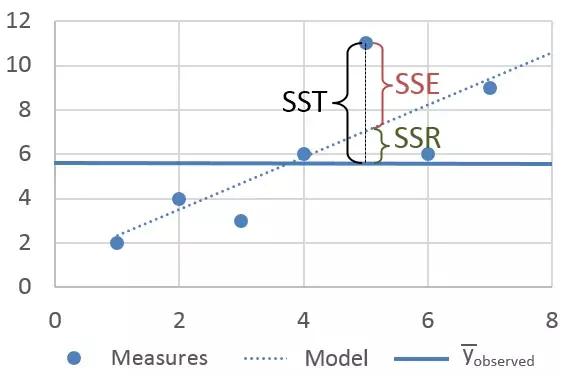

```{r}
#| include: false
#| echo: false
library(lme4); library(lmerTest)
 library(dplyr); library(ggplot2)


cex_axis = 1.5
cex_lab = 1.5

```


:::: {.columns}

::: {.column width="30%"}
<br> <br> <br>

:::

::: {.column width="70%"}
<br>

## Linear Model Outputs: What Does It All Mean?

<br> <br> 
*Julia Piaskowski*

*March 10, 2026* 
<br> <br> 

:::

::::


## Linear Model Review

$$Y_i = \beta_0 + \beta_1 X_i + \epsilon_i$$

$Y_i$ = dependent variable (there is only 1)

$X_i$ = independent variable(s) (there may be many)

$B_0$ = model intercept, the overall mean of $Y$

$B_1$ = how $Y$ changes with $X$ 

$\epsilon_i$ = model residual, the gap between the predicted value for $Y_i$ and its observed value


## The Residual Is Important {.smaller}

$$ \epsilon_i \sim N(0, \sigma)$$

- The residuals are normally distributed with a mean of zero and some standard deviation that we will estimate during the model-fitting process. 

- All model residuals are *independent and identically distributed*, "i.i.d." -- they are uncorrelated with each other and drawn from the same distribution (that has exactly one variance)

```{r}
#| echo: false
par(mar = c(0, 0, 0, 0))
x <- rnorm(500)
dx <- density(x, adjust = 2)
hist(x, freq = FALSE, col = "gray95", xlab = NULL, main = NULL, ylab = NULL); lines(dx, lwd = 2, col = "red3")
```


## Some Notes on Estimation

$$\hat{Y} = \beta_0 + \beta_1 X1 + \beta_2 X2 + ...\beta_k Xk$$

$$\hat{Y} = \mathbf{XB} $$ 

$\hat{Y}$ = predicted/fitted value  
$\beta_0$ = model intercept   
$\beta_1, \beta_2,...$ = model coefficients   

## Some Notes on Estimation {.smaller}
#### *Maximum likelihood Estimation (MLE)*

- How most frequentist statistical equations are "solved"
- Iterative approach, find the most probable set of model parameters (coefficients and variance terms) that maximizes a likelihood function
- If a data set is perfectly balanced, maximum likelihood has the same results as ordinary least squares    
- REML (restricted maximum likelihood) is a special type of MLE for mixed models.
- ordinary least squares (OLS) is the original method, but it's less flexible than MLE

::: {.r-stack background-color="#FDDC5C" logo=false}

# Definitions
:::


## P-value

::: {.custom-blockquote}
...a p-value is the probability under a specified statistical model that a statistical summary of the data (e.g., the sample mean difference between two compared groups) would be equal to or more extreme than its observed value.
:::

<br>

::: {.right-align .smaller}
-- [American Statistical Association](https://doi.org/10.1080/00031305.2016.1154108)
:::

## Confidence Interval

::: {.custom-blockquote}
 [A confidence interval percentage] is the frequency with which other unobserved intervals will contain the true effect....if all the assumptions used to compute the intervals were correct.
:::

<br>

::: {.right-align .smaller}
-- Greenland et al, [2016](https://pmc.ncbi.nlm.nih.gov/articles/PMC4877414/)
:::

-----------------------------------------------------

::: {.custom-blockquote}
The confidence level instead reflects the long-run reliability of the method used to generate the interval....if the same sampling procedure were repeated 100 times from the same population, approximately 95 of the resulting intervals would be expected to contain the true population mean. The frequentist approach sees the true population mean as a fixed unknown constant, while the confidence interval is calculated using data from a random sample.  
:::

<br>

::: {.right-align .smaller}
-- [Wikipedia](https://en.wikipedia.org/wiki/Confidence_interval)
:::

::: {.r-stack background-color="#FDDC5C" logo=false}

# Regression
:::

## Regression Example
Simple linear regression: one continuous independent variable
```{r}
data(anscombe); head(anscombe, n = 4)
```


## Regression Example

```{r}
m1 <- lm(y1 ~ x1, data = anscombe)
plot(anscombe$x1, anscombe$y1, pch = 21, bg = "blue3"); abline(3, 0.5)
```

## Regression Example {.smaller .scrollable}
- `print(m1)` is a pretty printing of some output      
- `summary(m1)` is a function with pre-selected and formatted output

```{r}
(s1 <- summary(m1))
```

## Regression Output

Model coefficients
```{r}
s1$coefficients
```

- the "(Intercept)" is $\beta_0$ and "x1" is $\beta_1$ 
- the Standard error of the estimate is given
- the t value is from the student's t-distribution
- P-value is evaluating if the estimate is different from zero

## Regression Output

Other valuable output
```{r}
s1$sigma # standard deviation of the residuals
s1$r.squared # model R^2
s1$adj.r.squared # adjusted model R^2
```

$R^2_{Adj} = 1 - \frac {(1-R^2)(1-n)} {n - k - 1}$

## Regression Output

Other valuable output: F-statistic      
- overall indicator of model fit     
- comparing to a null model: `y ~ 1` (intercept-only model)   

```{r}
s1$fstatistic
pf(s1$fstatistic[1], s1$fstatistic[2], s1$fstatistic[3], lower.tail = FALSE)
```

## Other Regression Output

```{r}
#| eval: false
s1$call # model reminder
s1$term # function data conditining
s1$residuals # raw residuals
s1$df # degrees of freedom
s1$aliased # check that no variables are linearly dependent
s1$fstatistic # model F-test
```

*(I tend not to need these unless doing something very specific)*

## More Regression Output
*From the model object*

```{r}
coef(m1)
residuals(m1)
```

## Possible Regression Output {.smaller}

```{r}
class(m1)
methods(class = "lm")
```

These are built-in methods for this class of object, and are dependent on the libraries loaded

## Possible Regression Output {.smaller}

- `confint()` provides confidence interval of parameters
- `extractAIC()` and `logLik()` return fit statistics
- `hatvalues()`, `dfbetas()`, `cooks.distance()`, and `influence()` are model diagnostics tools
- `drop()` and `add1()` drop/add terms sequentially and evaluate model fit statistics (not applicable for simple linear regression)
- `plot()` provides diagnostic plots (= `plot.lm()`)
- `simulate()` simulates data under the estimated model parameters
- `residuals()`, `rstandard()`, `rstudent()` produce raw, Pearson and studentized residuals, respectively
- `predict()` is for predicting a new data set

## Regression Output

Confidence Intervals
```{r}
confint(m1)
confint(m1, level = 0.90)
```

```{r}
#| echo: false
#| include: false
s1$sigma
s1$cov.unscaled
s1$sigma^2 * s1$cov.unscaled
vcov(m1)
```

## Regression Output {.smaller .scrollable}
Influential data points 

```{r}
influence(m1)
```

## Influence Measures
How much single data points influence model parmaters

- [DF fits:](https://en.wikipedia.org/wiki/DFFITS) change in fits
- [DF betas:](https://en.wikipedia.org/wiki/Influential_observation) change in parameters
- [PRESS statistic:](https://en.wikipedia.org/wiki/PRESS_statistic) leave-one-out predicted sum of squares
- [hat values](https://en.wikipedia.org/wiki/Projection_matrix), [Cook's D](https://en.wikipedia.org/wiki/Cook%27s_distance)(istance): X values that are extreme

(DF refers to difference)

## $R^2$ versus $r$ {.smaller}
- $R^2$ coefficient of determination



::: {.right-align}
[Image Source](https://www.sciencedirect.com/science/article/abs/pii/S0001457517303962)
:::

## $R^2$ versus $r$ {.smaller}
$R^2$ coefficient of determination
$$R^2 = 1 - \frac {SS_{error}}{SS_{reg} + SS_{errror}} = \frac {SS_{reg}}{SS_{reg} + SS_{errror}}$$

$$0 \leq R^2 \leq 1$$

- For measuring the strength of a regression 

- $R^2$ exists, $R$ does not

## $R^2$ versus $r$
$r$ coefficient of correlation:

$$r_{xy} = \frac{s_{xy}}{s_x s_y}$$

$$-1 \leq r \leq 1$$

- For understanding pairwise relationships

- $r^2$ = $R^2$ only in the case of simple linear regression

## Multiple Linear Regression 
Several continous variables effecting differences in a continuous independent variable

```{r}
data(mtcars)
head(mtcars, n = 4)
m2 <- lm(mpg ~ disp + hp + drat, data = mtcars)
```

## Multiple Linear Regression

```{r}
summary(m2)
```

## Multiple Linear Regression

```{r}
drop1(m2)
```

::: {.r-stack background-color="#FDDC5C" logo=false}

# ANOVA
*(Regression with categorical variables)*
:::


## ANOVA
```{r}
data(npk)
head(npk, n = 10)
```

## ANOVA
*(ignoring block)*

N: 2 levels, 0 and 1     
P: 2 levels, 0 and 1                   
K: 2 levels, 0 and 1            

$$ Y_{ijk+} = \beta_0 + \beta_1N +\beta_2P + \beta_3K $$

## ANOVA {.smaller .scrollable}
*(with block)*

**6 levels of block**      
block 1: 0 only     
block 2: 0 and 1       
block 3: 0 and 1      
....(blocks 4, 5, 6): 0 and 1     

*(set one level as level zero or reference level)* 

|ID |  block1 |  block 2  | block 3 | block 4 | block 5 | block 6 |
|---|---|---|---|---|----|---|
| A | 0 | 1 | 0 | 0 | 0  | 0 | 
| B | 0 | 0 | 1 | 0 | 0  | 0 |
| C | 0 | 0 | 0 | 1 | 0  | 0 |
| D | 0 | 0 | 0 | 0 | 1  | 0 |
| E | 0 | 0 | 0 | 0 | 0  | 1 |

$$ Y_{npk} = \beta_0 +...+ \beta_4 Bl2 + \beta_5 Bl3 + \beta_6 Bl4 + \beta_7 Bl5 + \beta_8 Bl6$$


## ANOVA

```{r}
m3 <- lm(yield ~N + P + K + block, data = npk)
summary(m3)
```

## ANOVA
Type 1 sums of squares
```{r}
anova(m3) 
```

## ANOVA

Type 3 sums of squares
```{r}
drop1(m3, test = "F") 
```

## Sums of Squares

**Type 1:** depends on order of independent variables    
**Type 3:** best for factorials    
**Type 2:**  use if you are sure there are no interactions    

**These only matter if the data are unbalanced**

[Decent explanation](https://www.r-bloggers.com/2011/03/anova-%E2%80%93-type-iiiiii-ss-explained/)

::: {.r-stack background-color="#FDDC5C" logo=false}

# Mixed Models

:::

## Mixed Models

```{r}
library(lme4); library(lmerTest)
m4 <- lmer(yield ~N + P + K + (1|block), data = npk)
m4
```

## Mixed Models

```{r}
fixef(m4) # fixed effects
ranef(m4) # random effects
```

## Mixed Models

```{r}
sigma(m4)
print(VarCorr(m4), comp = c("Variance", "Std.Dev"))
confint(m4)
```

## Mixed Models

A large number of functions are providing model conditions, not something estimated.

```{r}
#| eval: false
family(m4) # distribution (Gaussian, etc)
na.action(m4) # how missing data were handled
isREML(m4) # yes/no was REML used?
formula(m4) # formula used
getData(m4) # return data set 
nobs(m4) # data set size
ngrps(m4) # number of random groups
```


## Mixed Models
*So many methods*

```{r}
methods(class = "merMod")
methods(class = "lmerModLmerTest")
```

## Mixed Models

- Test random effects with a log likihood ratio test
```{r}
ranova(m4)
```

## Final Thoughts {.smaller}

- $R^2$, log likelihood, and AIC/BIC are ways to evaluate model fit
- the coefficient for regression can be directly interpreted; ANOVA coefficients are more complex
- Use type 3 sums of squares if you're unclear
- linear modelling objects have a large amount of output, use `methods()` to explore this content
- ANOVA is a special case of regression; they are both linear models


## Additional Resources 

- [An R Companion to Applied Regression](https://www.john-fox.ca/Companion/) (2019), $3^{rd}$ Ed., by
John Fox and Sanford Weisberg. 

- Learn more about [functions for detecting influential data](https://web.mit.edu/~r/current/arch/i386_linux26/lib/R/library/stats/html/influence.measures.html) 

- [SAS User Guide to Linear Models](https://documentation.sas.com/doc/en/statug/latest/statug_intromix_sect009.htm)

- [Linear Mixed Model Guide:](https://idahoagstats.github.io/mixed-models-in-R/) details on implementation of linear mixed models in R


